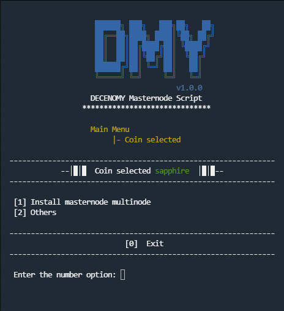
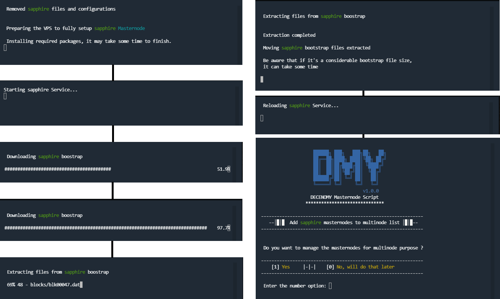
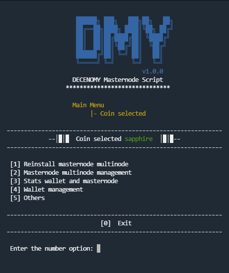

# Coin Selection

This menu has a dynamic result according to what is installed in the system.

If the coin masternode is not installed, it will prompt to install it, as can be seen in the following picture.

<figure><figcaption></figcaption></figure>

**#Picture Script\_20\_coin\_selection**

The installation process of the masternodes will display information about the current step. It is unlikely that the installation will get stuck, even though the screen may appear frozen or the process may seem to have stopped. It is advisable to wait for some time before aborting the process abruptly.

For reference, the complete automated process is presented in the picture below.

<figure><figcaption></figcaption></figure>

**#Picture Script\_21\_wallet\_installation**

Once the installation is completed the coin selection screen for installation will not be available anymore and the screen of coin selection will now be this one:

<figure><figcaption></figcaption></figure>

**#Picture Script\_22\_coin\_selection**

Moving forward in the script, everything is related to the coin that was selected on the Main Menu. In this case, for example, it is Sapphire.\
\
Moving forward in the script, everything is related to the coin that was selected on the Main Menu. In this case, for example, it is Sapphire.\

**1 - Reinstall masternode multinode**

This option will reinstall the masternode wallet.

**2 - Masternode multinode management**

All the tasks related to the multinodes can be performed within this option. The available options are List, Add, and Delete.

**3 - Stats wallet and masternode**

This option will open the menus to view wallet statistics and masternode statistics.

**4 - Wallet management**

A handful of tools to manage the wallet, such as wallet update, bootstraps, peers management, addnodes, restart service, and delete wallet, will be available in this option.
