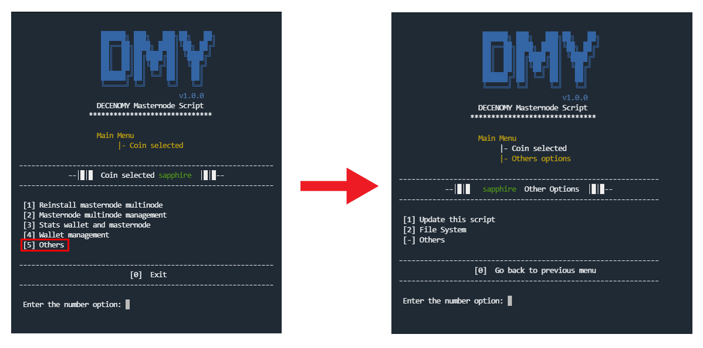
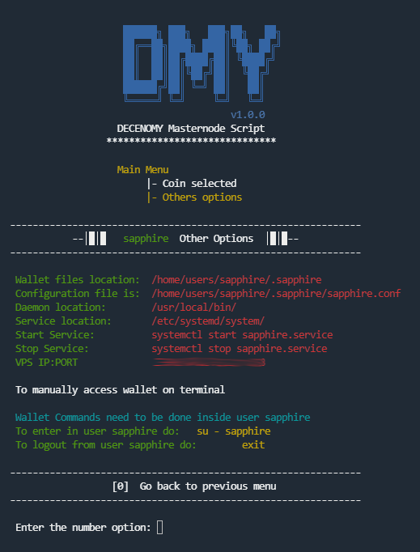

# Others

<figure><figcaption></figcaption></figure>

**#Picture Script\_7\_0\_Trans\_to\_others**

When selecting **\[5] Others**, a screen will appear with random options not suitable for others menus

#### 1 - Update this script

This option can be used in case of a script update. The script will assist the user by reading the latest version presented on GitHub and currently installed in the system (the version in use). The user will then be prompted to decide whether to upgrade. ( The same menu can be accessed directly from the main menu option number 18 )

#### 2 - File System

Important information related to the file system and file location regarding the environment basis is already described.

<figure><figcaption></figcaption></figure>

**#Picture Script\_7\_1\_File\_system**
