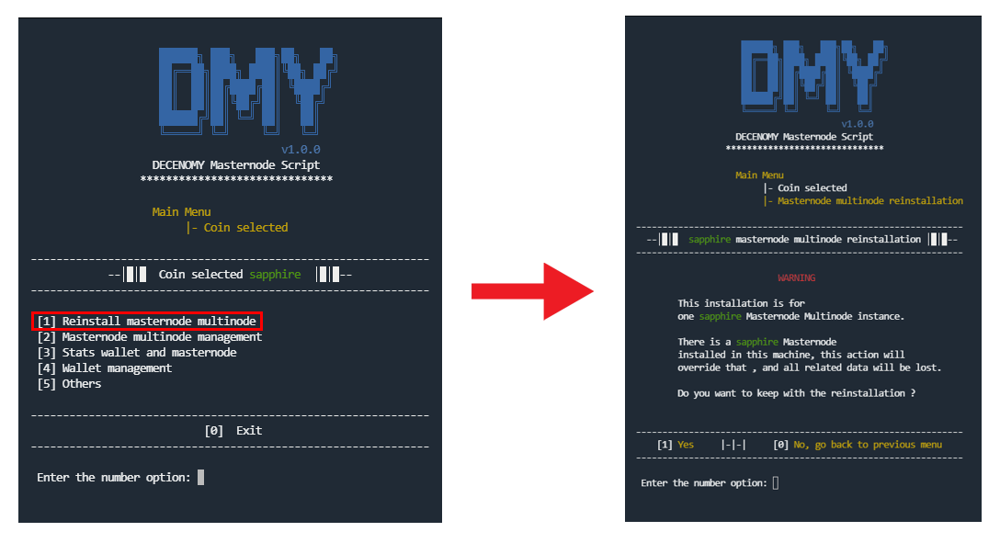

# Reinstall masternode multinode

<figure><figcaption></figcaption></figure>

**#Picture Script\_3\_1\_reinstall\_masternode\_multinode**

This option will perform a new installation of the masternode wallet in the system. For this action, all the previous files related to the previously selected coin will be deleted.

A warning screen will be displayed once the option is selected, advising the user about the upcoming steps related to the action.

