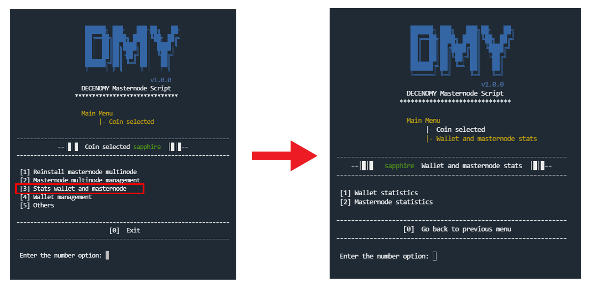
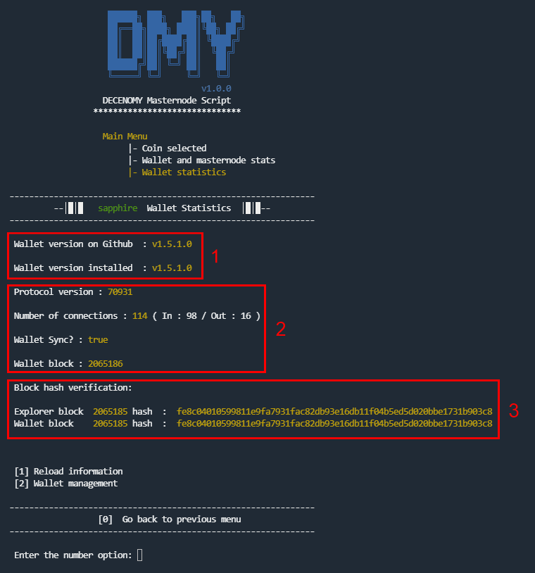
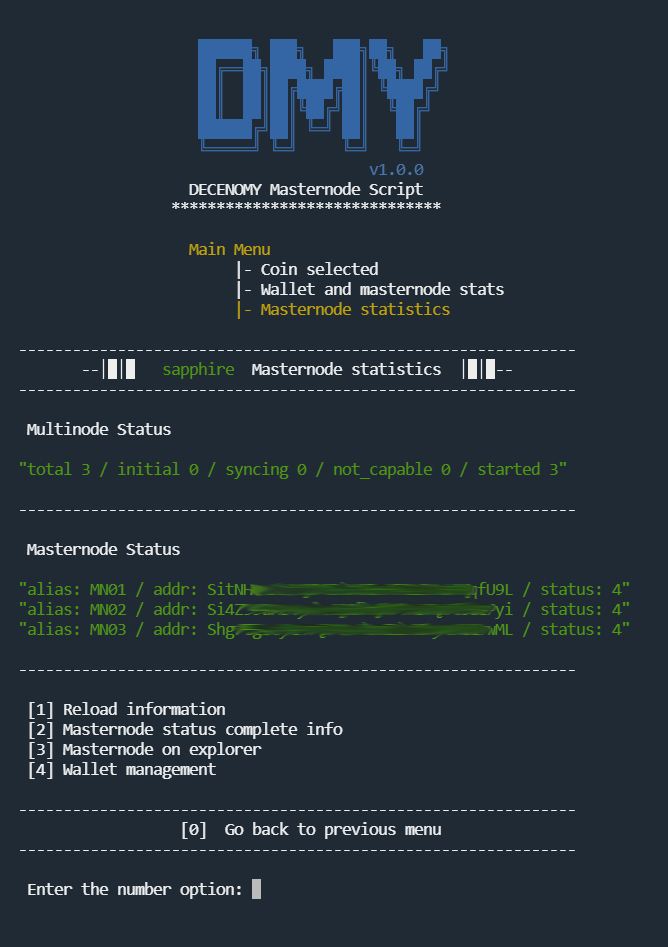
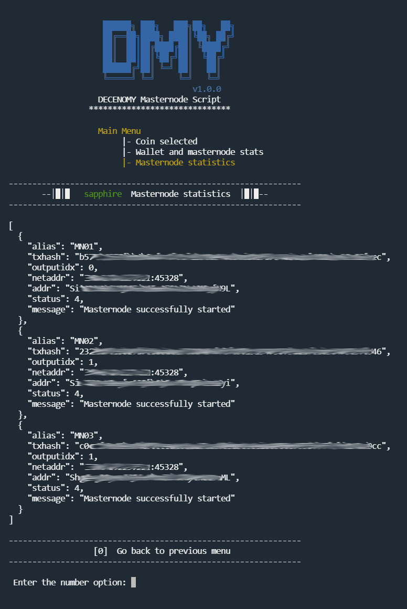
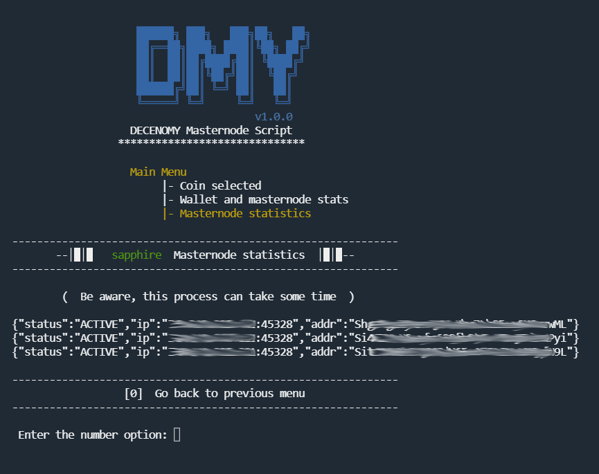

# Stats wallet and masternode

<figure><figcaption></figcaption></figure>

**#Picture Script\_5\_0\_Trans\_to\_wallet\_and\_masternode\_stats**

\
When selecting **\[3] Stats Wallet and masternode**, a screen will appear with options to choose the desired type of statistics.

### 1 - Wallet statistics

A comprehensive overview of all the necessary information to keep track of the wallet linked to the masternode.

<figure><figcaption></figcaption></figure>

**#Picture Script\_5\_1\_Wallet\_statistics**

#### Section 1

The wallet version is displayed in this section, showing the latest version presented on the Github repository of the coin being managed, as well as the version currently installed in the user's system.

#### Section 2

A more in-depth checkup is provided to give an overview of the installed wallet and its performance:

The protocol version number of the running wallet. The number of inbound and outbound connections, providing an overall report about connectivity with the network. Whether the wallet is synchronized with the blockchain or not. The last block that the wallet caught from the chain.

#### Section 3

Using the latest block available on the explorer, the script pings the Decenomy explorer to obtain the exact hash of that block. The same procedure is done with the wallet, using the same block number used to ping the explorer.

Ideally, the results should match. If they don't, we can easily identify a potential fork state of our wallet ( or the network ).

The **"Reload Information"** option is a straightforward action that will refresh the screen content to provide up-to-date information. This option can be selected as many times as needed.

If any reported information is incorrect, the option **"Wallet Management"** will be useful. It takes the user to another screen with numerous options to manage the wallet. This option is also available directly from the **"Coin Selected"** menu.

### 2 - Masternode statistics

In deep information about masternodes running in the system

<figure><figcaption></figcaption></figure>

**#Picture 1\_12\_Script\_masternode\_stats**

* _**Multinode Status**_ \
  Displays information about the overall broadcast of the multinode
* _**Masternode Status**_ \
  Resumes information about each masternode, reporting its state in the network. **Status: 4** is the norm adopted to report it as correctly running.

#### 1 - Reload information

This option is a straightforward action that will refresh the screen content to provide up-to-date information. This option can be selected as many times as needed.

#### 2 - Masternode status complete info

Classic view of each masternode, in more detailed info about its state in the network

<figure><figcaption></figcaption></figure>

**#Picture 1\_13\_Script\_Masternode\_status\_complete\_info**

#### 3 - Masternode on explorer

This option will ping the Decenomy explorer using the VPS IP to check if the masternode is actually running and broadcasting information to the blockchain. This process and the information provided will help avoid the user from having to check the explorer themselves, making this tool the only place needed to check the real state of the masternode.

<figure><figcaption></figcaption></figure>

**#Picture 1\_14\_Script\_Masternode\_on\_explorer**

#### 4 - Wallet management

If any reported information is incorrect, this option will be useful. It takes the user to another screen with numerous options to manage the wallet. This option is also available directly from the **"Coin Selected"** menu.\
