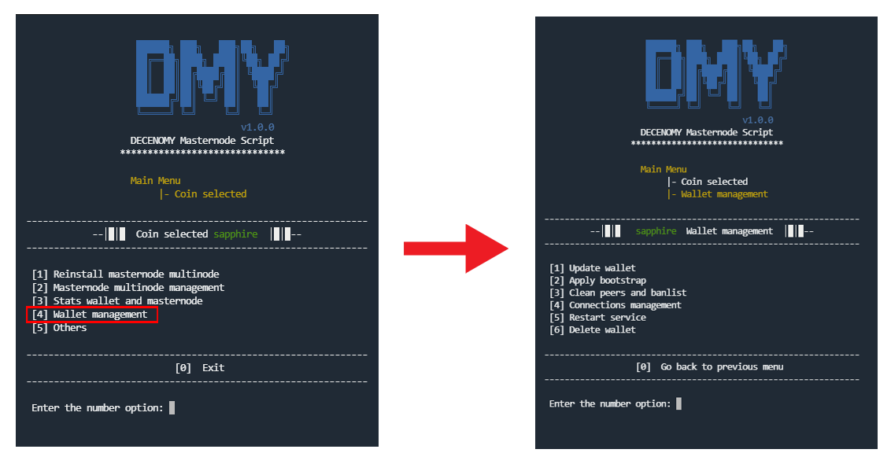

# Wallet management

<figure><figcaption></figcaption></figure>

**#Picture Script\_6\_0\_Trans\_to\_wallet\_management**

When selecting **\[4] Wallet management**, a screen will appear with options to fully manage the masternode wallet.\
\
**1 - Update wallet**

Similar to what is presented in the **"Wallet Statistics"** options that we checked before, the wallet version from Github and the wallet installed in the system are displayed on the screen before a confirmation to update the wallet is given. This method will not destroy the already set masternode; it will only change the binaries related to the wallet and restart the service (not the masternode). Such a process is useful in case of a mandatory wallet release or any other wallet release that needs to be updated.

#### 2 - Apply bootstrap

This option downloads an official bootstrap from the Decenomy explorer and replaces the existing files with the newly downloaded ones. The bootstrap is used in cases where fast sync is needed or when a fork in the wallet is detected. It's the most secure process to quickly sync up to the current blocks of the blockchain in question. This method does not destroy the already set masternode; it only changes the chain block-related files.

#### 3 - Clean peers and banlist

In some cases of extremely poor connectivity, it may be necessary to clean specific files like peers.dat and banlist.dat. This option will perform that process and restart the wallet service. This method will not destroy the already set masternode; it will only clean the peers.dat and banlist.dat files.

#### 4 - Connections management

This option performs the method to add connections, also known as addnodes, to improve connectivity.

* _**List of extra connections on the wallet**_ This option lists the connections that were previously added.
* _**Add connections to the wallet**_ This option provides an easy method to add connections, along with a guideline to assist in the process. Please note that it's only possible to add one connection at a time. The connection to be added must have the following format **addnode=188.40.85.215:45328** otherwise, it will not work properly.
* _**Delete connections from the wallet**_ This option provides an easy method to delete connections. You only need to type the number of the line (the number before the word "addnode") and press enter to delete it. Please note that it's only possible to delete one connection at a time.

#### 5 - Restart service

Given that several routines in this script come with an integrated service restart, we recommend utilizing this function only for isolated scenarios, such as collateral changes or in the event of service malfunction.

#### 6 - Delete wallet

This is a straightforward option to delete the wallet. This method will remove all references to the wallet in the system as well as the masternode. Since the userID is created every time the wallet is installed, it will also be deleted in this "delete wallet" routine. Once this process is completed, the "Coin Selection" menu will appear as if the wallet for the selected coin was never installed.
