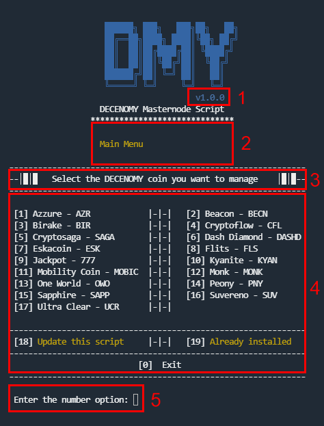

# Script Screen Overview

To provide a more detailed understanding of this tool, it would be helpful to explain how the information is organized on the screen. This will make it easier for users to understand the documentation and how to use the script.

<figure><figcaption></figcaption></figure>

**#Picture Script\_0\_screen\_overview**

#### Section 1

This refers to the script version number that is installed and currently in use.

#### Section 2

In this area, a section tree will be displayed to help the user understand where they are in the script's menu. It will also serve as a useful reference in case of support needs, allowing for easy navigation to the same screen.

#### Section 3

This is the current menu title or a brief description of the screen that is currently displayed. It will always display the selected coin after that action has been taken.

#### Section 4

All the information need to operate the screen as well as the options available

#### Section 5

Each screen will have its own set of options to enter.
